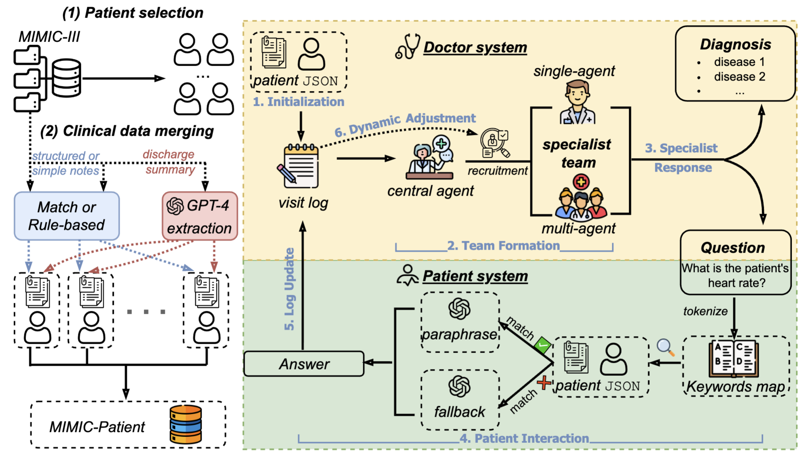

# DynamiCare: Multi-Agent Collaborative Diagnostic System
Available on [arXiv](https://arxiv.org/abs/2507.02616)
## Overview


## Abstract
The rise of Large Language Models (LLMs) has enabled the development of specialized AI agents with domain-specific reasoning and interaction capabilities, particularly in healthcare. While recent frameworks simulate medical decision-making, they largely focus on single-turn tasks where a doctor agent receives full case information upfront—diverging from the real-world diagnostic process, which is inherently uncertain, interactive, and iterative. In this paper, we introduce MIMIC-Patient, a structured dataset built from the MIMIC-III electronic health records (EHRs), designed to support dynamic, patient-level simulations. Building on this, we propose DynamiCare, a novel dynamic multi-agent framework that models clinical diagnosis as a multi-round, interactive loop, where a team of specialist agents iteratively queries the patient system, integrates new information, and dynamically adapts its composition and strategy. We demonstrate the feasibility and effectiveness of DynamiCare through extensive experiments, establishing the first benchmark for dynamic clinical decision-making with LLM-powered agents.
## Architecture

### Core Components

#### 1. Doctor Agent (`doctor_agent.py`)
The main diagnostic system with multiple specialist coordination.

#### 2. Single Doctor Agent (`doctor_agent_single.py`)
Simplified version with single specialist handling each case.

#### 3. Answer Agent (`answer_agent.py`)
Patient simulator that responds to doctor questions based on structured medical records.

#### 4. Data Converter (`data_convert.py`)
Utility to convert diagnosis text to standardized ICD-9 codes using the BioPortal API.

## Requirements

### Dependencies
```bash
pip install pandas openai requests
```

### API Keys
Create a `config.json` file in the project root:
```json
{
  "OPENAI_API_KEY": "your-openai-api-key-here"
}
```

For `data_convert.py`, you'll also need a BioPortal API key (register at https://bioportal.bioontology.org/).


## Usage

### Running Multi-Agent Diagnostic System

```bash
python doctor_agent.py --path <patient_json_file> --model gpt-4o --max_rounds 10
```

**Arguments:**
- `--path`: Path to patient JSON file or directory (processes all `.json` files in directory)
- `--model`: OpenAI model to use (default: `gpt-4o`)
- `--max_rounds`: Maximum Q&A iterations (default: 10)

**Output:**
- **Logs**: `data/log/log_{patient_id}_{model}.json` - Detailed execution trace
- **Results**: `data/result/result_{patient_id}_{model}.json` - Final diagnosis and ground truth

### Running Single-Agent System

```bash
python doctor_agent_single.py --path <patient_json_file> --model gpt-4.1 --max_rounds 10
```

Same arguments as multi-agent version.

### Testing Patient Simulation

```bash
python answer_agent.py --path <patient_json_file> --question "What medications are you taking?" --model gpt-4.1
```

**Arguments:**
- `--path`: Path to patient JSON file
- `--question`: Question to ask the patient (omit for initial introduction)
- `--model`: OpenAI model to use

### Converting Diagnoses to ICD-9 Codes

```bash
python data_convert.py
```

Converts diagnosis text in JSONL files to standardized ICD-9 codes.

## Data Preparation

The system is designed to work with MIMIC-III Clinical Database. The `data_process.ipynb` notebook includes preprocessing steps:

1. **Patient Selection**
2. **Data Integration**

Due to privacy issues, the curated MIMIC-Patient dataset will be made avaliable on PhysioNet.


## Citation

If you use this code in your research, please cite:

```bibtex
@article{shang2025dynamicare,
  title={DynamiCare: A Dynamic Multi-Agent Framework for Interactive and Open-Ended Medical Decision-Making},
  author={Shang, Tianqi and He, Weiqing and Zheng, Charles and Li, Lingyao and Shen, Li and Zhao, Bingxin},
  journal={arXiv preprint arXiv:2507.02616},
  year={2025}
}
```

